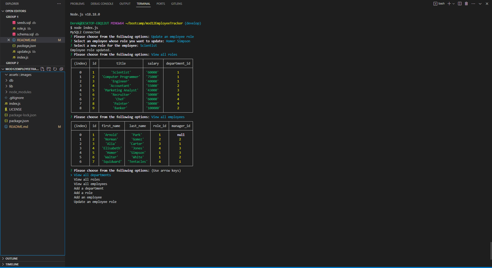

# Employee Tracker

## Description
- My motivation for this project was to create a content managing system(CMS).
- I built this project using JavaScript, Node.js, Inquirer version 8.2.4, and MySQL2.
- This app allows the user to view tables in an employee database and to make changes to those tables if necessary.
- I learned from making this application how to use and manipulate databases with MySQL2.

## Installation
- This application requires Node.js, Inquirer version 8.2.4, and MySQL2.

## Usage
- Enter 'node index.js' in terminal to start the program. Answers questions from the prompt to view or edit tables. Press "CTRL + C" to exit.

Video Demonstration:

https://drive.google.com/file/d/1p2YYyNQTQ2gT7OYwQDvI-P3SZ0tHo1S2/view

## Credits
N/A

## License
MIT
